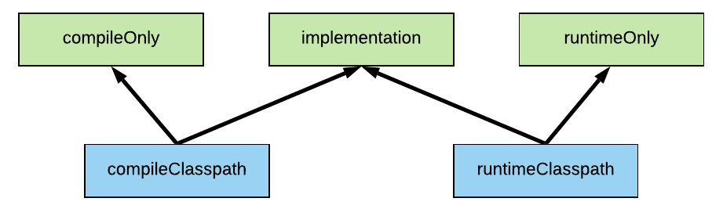
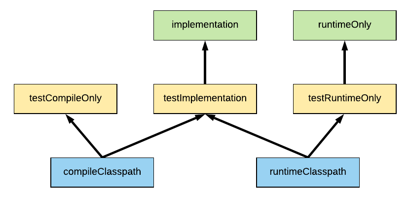

When you’re building and running a Java project there are two classpaths involved:

Compile classpath – this is a list of dependencies that are required for the JDK to be able to compile Java code into .class files
Runtime classpath – this list of dependencies is required to actually run the compiled Java code
When we’re configuring Gradle dependencies all we’re really doing is configuring which dependencies should appear on which classpath. Given there are only two classpaths, it makes sense that we have three options to declare our dependencies.

compileOnly – put the dependency on the compile classpath only
runtimeOnly – put the dependency on the runtime classpath only
implementation – put the dependency on both classpaths

It’s worth noting that it’s a very similar story for test dependencies, with the Gradle Java plugin providing the testRuntimeOnly, testImplementation, and testCompileOnly dependency configurations. What dependencies you add to these configurations determines how your test compile and runtime classpaths will be created.

Of course, these test configurations also inherit from the non-test configurations, at least for implementation and runtime. After all, your test code does need to call your non-test code.

